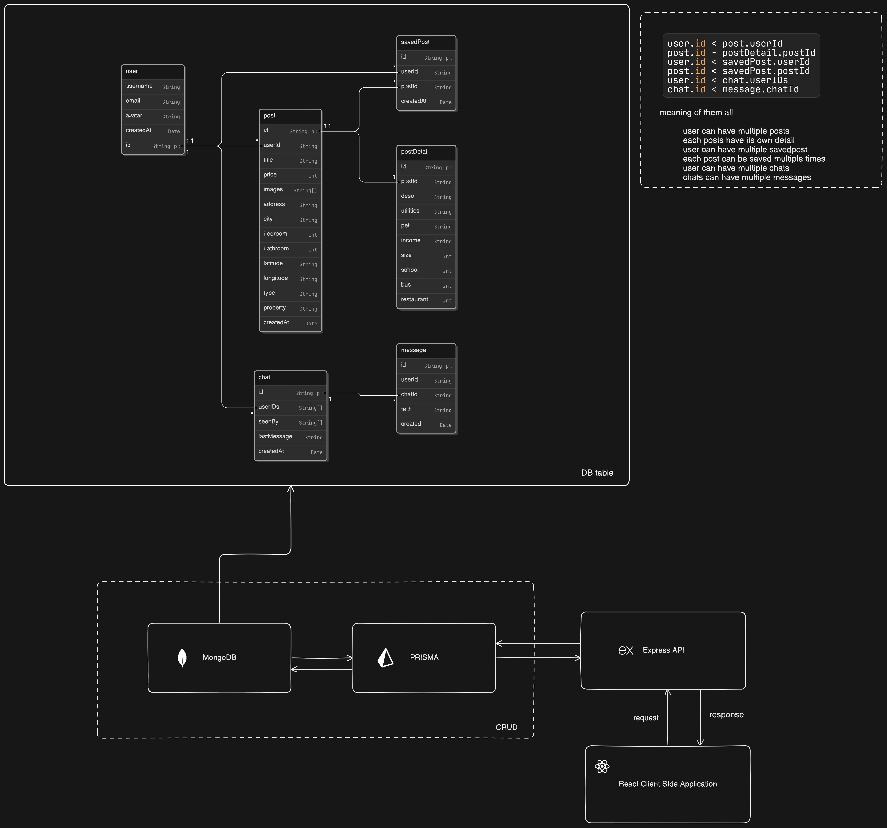

# Homing.com

## Table of Contents

- [Introduction](#introduction)
- [Features](#features)
- [Installation](#installation)
- [Usage](#usage)
- [Architecture](#architecture)
- [Contributing](#contributing)
- [License](#license)

## Introduction

Welcome to Homing.com! This project is designed to provide a comprehensive solution for finding and managing homes. Whether you're looking to buy, rent, or sell, Homing.com has got you covered.

## Features

- User registration and authentication
- Posting and managing property listings
- Saving favorite posts
- Chatting with other user
- Detailed property information

## Installation

To get started with Homing.com, follow these steps:

1. Clone the repository:
   git clone https://github.com/Vidhnavyrs/homingdotcom.com.git
   cd homingdotcom
2. Install the dependencies:
   npm install
3. Set up your environment variables:
   cp .env.example .env
4. Run the backend:
   you can use nodemon or console-ninja to do so
   use: console-ninja --watch node app.js
   or
   use: nodemon app.js
5. Run the Frontend:
   npm run dev

## Usage

Once the application is running(both backend and frontend), you can access it in your web browser at http://localhost:5173. You can register a new account, browse property listings, save your favorites, and chat with other users.

## Architecture

Homing.com is built using the following technologies:

- MongoDB
- Prisma
- React
- Node.js
- Express
  Here's a high-level overview of the system architecture:
  

## Contributing

This project is a group collaboration with [Vineet](https://github.com/dxfuryman).
Contributions are welcome! Please follow these steps to contribute:

- Fork the repository.
- Create a new branch for your feature or bugfix.
- Make your changes and commit them with clear and concise messages.
- Push your changes to your forked repository.
- Create a pull request to the main repository.

## License

This project is licensed under the MIT License.
